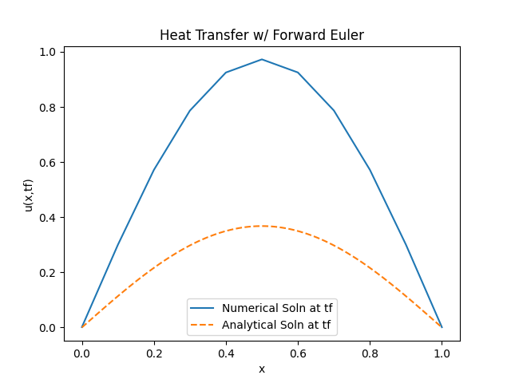
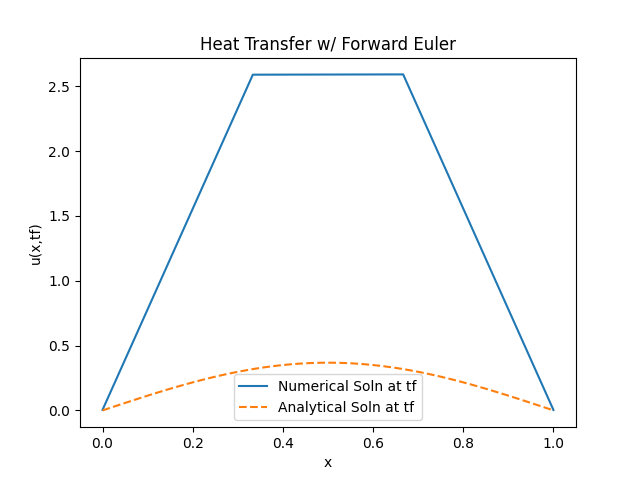
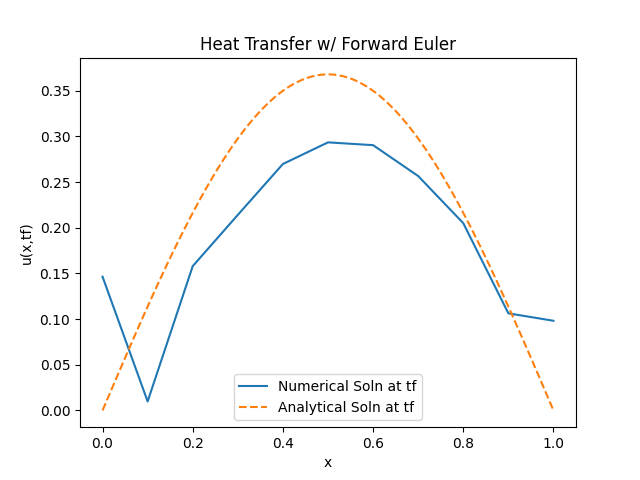
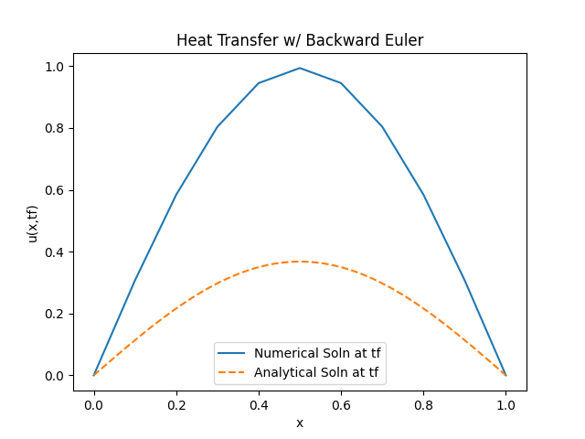
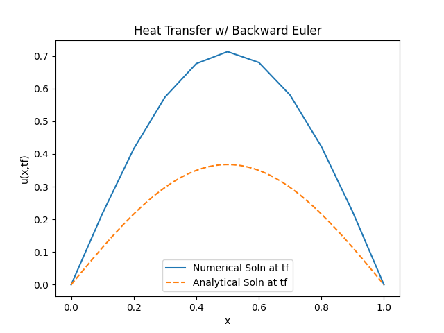
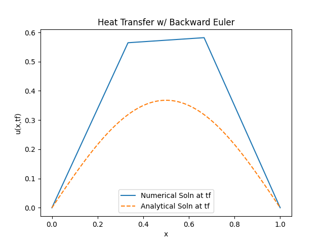

# 1D-HeatTranfer-FEA
The purpose of this project was to solve a 1D heat transfer problem given initial and Dirichlet boundary conditions:
```
#Problem
U_t - U_xx = F(x,t) (x,t): (0,1) x (0,1)
F(x,t) = (pi**2 - 1) * e^(-t) * sin(pi * x)
#Dirchelet boundary conditions
U(x,0) = sin(pi * x)
U(0,t) = U(1,t) = 0
```
After solving the problem numerically it was plotted against the numerical solution:
```
U(x,t) = e^(-t) sin(pi * x)
```
# Included Files
## forwardEuler.py
This file contains the solution using forward euler.
## backwardEuler.py 
This file contains the solution using backward euler. Main difference from forward Euler.py is how U is calculated.
## plot
This directory is where different plot are stored. Plots contain different number of nodes and timestep size
## hand-written-work.pdf
This pdf contains my handwritten work which includes weak form derivation, forward euler implementation, gelerkin expansion implementation, calculating mass and stiffness matrix. 

# General Process
1. Derive weak form of of PDE with the use of integration by parts
2. Utilize forward euler to approximate U_t
3. Use Gelerkin expansion to approximate integrals and convert them to matrix form. 
4. Calculate mass and stiffness matrix by hand
5. Begin building the code:
6. Build a uniform grid and connectivity map
7. Define parent grid
8. Initialize matrices and local matrices/vectors 
9. Build K and M matrix based on earlier calculations
10. Use quadrature to solve F vector
11. Apply boundary conditions
12. Given initial U vector, solve for U(n+1)
    
# Forward Euler
Below is the plot generated using forwardEuler.py with number of nodes (N) being 11 and dt=1/551 at the final timestep. As seen in the plot, with this small of a timestep forward euler is stable. 



I then evaluated the effect of a smaller timestep. While I was unable to determine the exact point at which the solution became unstable, based on trial and error I was able to determine that the solution becomes largely unstable at a timestep of 0.2. This instability arises from the explicit nature of forward euler. The instability is characterized by both ends of the solution not abiding to the boundary conditions.



I then evaluated the effect that reducing the number of nodes would have on the solution. As seen in the image the accuracy of the solution decreases as we are unable to have enough points to have a smooth curve that resembles the analytical solution.



# Backward Euler
Below is the plot generated using backwardEuler.py with number of nodes (N) being 11 and dt=1/551 at the final timestep. As seen in the plot, the solution is stable and resembles the stable solution of the forward euler solution. 



I then evaluated the effect of a smaller timestep of 0.5 and h(spacial step). As seen in the plot, using backward Euler the solution always remains stable resulting in the same plot. This is due to the implicit nature of using backward euler. 



I then evaluated the effect that reducing the number of nodes would have on the solution. As seen in the image the accuracy of the solution decreases as we are unable to have enough points to have a smooth curve that resembles the analytical solution.




